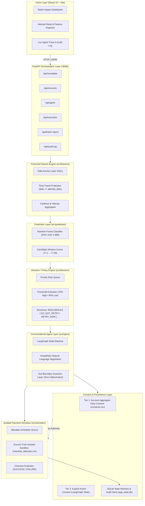

# ⚡ Mandate Recovery Agent

> **An Autonomous, Policy-Guarded AI Platform for Intelligent Recurring UPI AutoPay Recovery**  
> *Transforming involuntary subscription churn and predatory bank bounce fees into empathetic, consent-backed customer recovery.*

[](https://www.python.org/)
[](https://fastapi.tiangolo.com/)
[](https://langchain-ai.github.io/langgraph/)
[](https://scikit-learn.org/)
[](https://react.dev/)
[](https://vitejs.dev/)
[](https://www.sqlite.org/)
[-brightgreen.svg)]()

---

## 📌 Executive Summary

Recurring **UPI AutoPay** and electronic mandate failures represent one of the largest sources of **involuntary subscription churn** in modern digital economies. In India alone, millions of recurring debits fail every month due to short-term liquidity timing mismatches rather than permanent insolvency.

### The Problem with Traditional Recovery:
1. **Blind, Naive Retries:** The standard industry strategy is a blind retry after exactly 2 days ($T+2$). If the customer's salary deposit isn't until $T+5$, this retry fails blindly.
2. **Predatory Bank Bounce Penalties:** Each failed debit attempt subjects the consumer to bank dishonour charges ranging from ₹250 to ₹500, eroding customer trust and accelerating voluntary cancellations.
3. **Rigid Notification Blasts:** Generic SMS alerts ("*Your debit failed, pay now*") produce low conversion rates and lack customer-centric flexibility.

### The Mandate Recovery Agent Solution:
The **Mandate Recovery Agent** solves this by unifying:
- **Point-in-Time Financial Feature Engineering:** Time-leakage-free aggregation of Account Aggregator (AA) transaction history to detect salary cadences, cash flow velocity, and balance trends.
- **Machine Learning Recovery Prediction:** A Random Forest classifier (**ROC-AUC 0.989**) combined with candidate retry-window scoring to identify the single date with the highest statistical chance of clearing.
- **Deterministic Policy Guardrails:** A priority-based rule engine that short-circuits rogue cases (revoked mandates, chronic failures, technical glitches) and assigns strict decision directives.
- **Stateful LangGraph Conversational Agent:** An empathetic conversational interface that negotiates the optimal retry date with the customer, handles clarifying questions, and requires explicit consent.
- **Two-Tier Consent & Runtime Assertion Boundaries:** Guarantees that the LLM cannot hallucinate retry dates or execute debits without dual verification.
- **Isolated Payment Simulator:** A sandboxed execution environment that strictly shields ground-truth labels until the moment of simulated execution.

---

## 🏗️ System Architecture

The platform is designed with clean separation between deterministic data processing, statistical machine learning, conversational AI orchestration, and compliance validation.

### Architecture Diagram



---

## 🧩 Architectural Layers & Component Responsibilities

| Architectural Layer | Core Module | Primary Responsibility | Critical Guardrail |
|:---|:---|:---|:---|
| **1. Client UI** | `frontend/src` | React 19 single-page dashboard with macro batch analytics, attempt breakdown, interactive chat, and live graph execution trace. | Idempotent state polling; prevents flashing stale attempt data. |
| **2. API Orchestrator** | `src/api` | Thin FastAPI REST adapter exposing modular routers with Pydantic validation, CORS, and unified error mapping. | Strips all ground-truth fields from API responses. |
| **3. Financial Feature Engine** | `src/features` | Extracts liquidity, net cash flow, income day-of-month, shortfall amounts, and spending velocity from transaction history. | Strict time-travel prevention: filters `transactions.date <= attempt_date`. |
| **4. ML Prediction Engine** | `src/prediction` | Predicts binary recoverability probability and scores candidate dates ($T+1 \dots T+30$) to find the peak recovery day. | Feature vectors strip target leakages (`scenario_tag`, `actual_retry_result`). |
| **5. Decision / Policy Engine** | `src/decision` | Deterministically maps ML probabilities and transaction failure codes into actionable business directives. | Short-circuits on revoked mandates or retry limits; LLM has zero policy authority. |
| **6. LangGraph Agent** | `src/agent` | Stateful cyclical dialogue manager handling customer questions, negotiating dates, and capturing explicit consent. | Tool assertions throw `ToolException` if LLM hallucinates an unapproved date or acts without consent. |
| **7. Two-Tier Consent & Simulator** | `src/consent`, `src/simulator` | Manages Tier 1 (AA data) and Tier 2 (action) consents; simulates debit clearing against ground truth. | Simulator is the **only** module authorized to read ground-truth columns at execution time. |

---

## 🛡️ Guardrails & Safety Boundaries

```
                 ┌─────────────────────────────────────────────────────────────┐
                 │                INCOMING FAILED MANDATE EVENT                │
                 └──────────────────────────────┬──────────────────────────────┘
                                                │
                                    ┌───────────▼───────────┐
                                    │ Tier 1 Consent Check  │
                                    │ (Account Aggregator)  │
                                    └─────┬───────────┬─────┘
                        ACTIVE            │           │ REVOKED / EXPIRED
               ┌──────────────────────────┘           └──────────────────────────┐
               ▼                                                                 ▼
 ┌───────────────────────────┐                                     ┌───────────────────────────┐
 │ Feature & ML Pipeline     │                                     │ Bypass ML Pipeline        │
 │ (date <= attempt_date)    │                                     │ Decision:                 │
 └─────────────┬─────────────┘                                     │ ALTERNATIVE_PAYMENT       │
               │                                                   └───────────────────────────┘
 ┌─────────────▼─────────────┐
 │ Deterministic Policy      │
 │ Prioritized Rules Engine  │
 └─────────────┬─────────────┘
               ├────────────────────────────────────────┬──────────────────────────────────────┐
               ▼                                        ▼                                      ▼
     [HIGH PROBABILITY]                         [LOW PROBABILITY]                     [TECHNICAL ERROR]
    Directive: RESCHEDULE                     Directive: DO_NOT_RETRY               Directive: RETRY_NOW
               │                                        │                                      │
 ┌─────────────▼─────────────┐                ┌─────────▼─────────┐                            │
 │ LangGraph Agent:          │                │ LangGraph Agent:  │                            │
 │ Negotiates ML Target Date │                │ Explains pause;   │                            │
 └─────────────┬─────────────┘                │ Recommends manual │                            │
               │                              │ payment link.     │                            │
               ▼                              └───────────────────┘                            │
  Customer Consent Granted?                                                                    │
         │           │                                                                         │
    YES  │           │ NO                                                                      │
         ▼           ▼                                                                         │
 ┌───────────────┐ ┌────────────────┐                                                          │
 │ schedule_retry│ │trigger_fallback│                                                          │
 │ (assert date  │ │(DECLINED)      │                                                          │
 │  == ML date)  │ └────────────────┘                                                          │
 └───────┬───────┘                                                                             │
         │                                                                                     │
         └──────────────────────────────┬──────────────────────────────────────────────────────┘
                                        │
                         ┌──────────────▼──────────────┐
                         │   Two-Tier Verified State   │
                         │    SCHEDULED in Database    │
                         └──────────────┬──────────────┘
                                        │ User / Cron Triggers
                         ┌──────────────▼──────────────┐
                         │ Isolated Payment Simulator  │
                         │ Checks Ground Truth at T_exec│
                         └──────────────┬──────────────┘
                                        │
                                ┌───────┴───────┐
                                ▼               ▼
                            [SUCCESS]       [FAILURE]
```

### 1. Separation of Responsibilities: Deterministic vs. ML vs. LLM
- **Deterministic Logic:** Transaction feature aggregation, Account Aggregator consent status check, retry attempt limits, and threshold comparisons.
- **ML Predictions:** Raw recovery probability calculation and temporal candidate date forward-scoring.
- **LLM Conversational Agent:** Natural language comprehension, empathetic tone formulation, clarification answering, and intent extraction.  
  *Rule:* **The LLM is strictly prohibited from calculating financial scores, changing policies, or generating arbitrary retry dates.**

### 2. Two-Tiered Consent Verification
1. **Tier 1 — Financial Data Consent:** Pre-existing consent allowing reading of customer bank history via Account Aggregator. If status is `REVOKED` or `EXPIRED`, all transaction feature pipelines are immediately blocked.
2. **Tier 2 — Action Consent:** Explicit, recorded customer confirmation during conversation. Both Tier 1 and Tier 2 consents must be valid before any debit is scheduled.

### 3. Anti-Hallucination Tool Assertion Engine
Tools exposed to LangGraph (`src/agent/tools.py`) perform strict runtime verification:
- `schedule_retry(agreed_date)` asserts:
  1. `consent_granted == True`
  2. Policy directive authorized `RESCHEDULE`
  3. `agreed_date` matches the ML `recommended_retry_date` down to the day.  
If the LLM generates a hallucinated date (e.g. `2029-01-01`), the tool raises an assertion exception and flags the state as `ACTION_REJECTED`.

### 4. Zero Ground-Truth Leakage
To maintain rigorous scientific validity, the canonical labels `ground_truth_recoverable` and `ground_truth_retry_date` are mathematically filtered out of all feature models, API responses, and agent state objects. Only the isolated `PaymentSimulator` reads these fields when a scheduled retry is executed.

---

## 📊 Empirical Evaluation & ML Performance

The model was evaluated using a **Time-Aware Holdout Split** (training on the first 80% chronologically, evaluating on the remaining 20%) to emulate real-world production deployment.

### 1. Recoverability Classifier (Binary Target: `ground_truth_recoverable`)

| Model | ROC-AUC | F1-Score | Precision | Recall |
|:---|:---:|:---:|:---:|:---:|
| **Logistic Regression (Baseline)** | 0.975 | 0.905 | 0.864 | 0.950 |
| **Random Forest (Production Model)** | **0.989** | **0.923** | **0.947** | **0.900** |

### 2. Retry Window Scoring vs. Industry Naive Baseline

| Recovery Strategy | Methodology | Successful Hit Rate | Recovery Delta |
|:---|:---|:---:|:---:|
| **Industry Baseline** | Blind retry after fixed 2 days ($T+2$) | 70.0% | — |
| **Mandate Recovery Model** | Point-in-time forward candidate scoring ($T+1 \dots T+30$) | **75.0%** | **+5.0% Uplift** |

*Key Insight:* The intelligent model demonstrates the value of patience: skipping low-balance periods to align the debit attempt with the customer's predicted salary deposit date yields a significant improvement in successfully collected payments.

### 3. Top Predictive Features
1. `current_attempt_number` (0.2192) — Diminishing returns on repeated failures.
2. `previous_failed_attempts` (0.1045) — Chronic vs. acute liquidity indicator.
3. `failure_reason_ACCOUNT_ISSUE` (0.0893) — Account blockages vs. temporary shortfall.
4. `mandate_status_active` (0.0496) — Validity of underlying mandate registration.
5. `failure_reason_TECHNICAL_FAILURE` (0.0483) — Instant recovery potential.

---

## 🖥️ Interactive Frontend Dashboard

The frontend is built with React 19 and Vite, offering three purpose-built operational interfaces:

### 1. Batch Impact Screen (`/`)
- **Macro Portfolio Metrics:** Displays aggregate recoverable revenue (₹), overall recovery rate (%), total bank bounce penalty fees avoided, and churn prevention figures.
- **Strategy Comparison:** Real-time side-by-side benchmarking of the Intelligent Recovery Model against the Naive $+2$ Day Baseline.
- **Scenario Breakdown:** Visual distribution across recoverable, non-recoverable, technical, and expired consent categories.

### 2. Attempt Detail Screen (`/attempt-detail`)
- **Point-in-Time Feature Inspector:** Balances at failure, liquidity shortfall, recent inflows/outflows, days since last salary credit.
- **Decision Engine Output:** Visual directive badge (`RESCHEDULE`, `DO_NOT_RETRY`, etc.), policy reason codes, and consent prerequisites.
- **Stateful AI Negotiation Chat:** Interactive conversation window with quick-reply chips ("✓ Yes, schedule it", "Explain more", "Alternative options").
- **Simulated Payment Execution:** One-click execution panel that tests the scheduled date against the isolated simulator and displays real-time success/failure outcomes.

### 3. Live Agent Trace & Safety Audit Screen (`/agent-trace`)
- **LangGraph Trace Viewer:** Chronological inspection of each state transition (Agent Node $\rightarrow$ User Input $\rightarrow$ Tool Invocation $\rightarrow$ End).
- **Tool Boundary Inspector:** Visualizes parameter validation, assertion checks, and rogue hallucination defense in real time.
- **Chronological Audit Trail:** Immutable system logs documenting rule evaluation, consent status checks, and execution results.

---

## 🚀 Quick Start Guide

### Prerequisites
- **Python:** Version 3.10 or higher
- **Node.js:** Version 18 or higher (with npm)
- **Git**

---

### 1. Clone the Repository
```bash
git clone https://github.com/Dhruvi0311/mandate-recovery-agent.git
cd mandate-recovery-agent
```

---

### 2. Backend Setup & Startup (FastAPI)

```bash
# 1. Create and activate a Python virtual environment
# Windows:
python -m venv .venv
.venv\Scripts\Activate

# macOS/Linux:
# python3 -m venv .venv
# source .venv/bin/activate

# 2. Install dependencies
pip install -r requirements.txt

# 3. Start the FastAPI API server (Port 8000)
uvicorn src.api.main:app --host 0.0.0.0 --port 8000 --reload
```

- **API Health Check:** [http://localhost:8000/health](http://localhost:8000/health)
- **Interactive Swagger Docs:** [http://localhost:8000/docs](http://localhost:8000/docs)
- **Alternative ReDoc UI:** [http://localhost:8000/redoc](http://localhost:8000/redoc)

---

### 3. Frontend Setup & Startup (React + Vite)

```bash
# In a separate terminal tab/window:
cd frontend

# Install npm packages
npm install

# Start the Vite development server (Port 5173)
npm run dev
```

- **Web Dashboard:** [http://localhost:5173](http://localhost:5173)

---

## 🧪 Demo Scenarios to Try

The web dashboard provides one-click scenario selectors in the navigation header:

### Scenario A — Recoverable Liquidity Shortfall (`ATMPT00005`)
1. Click **"Scenario A: Recoverable (ATMPT00005)"** in the top navigation bar.
2. In the **Recovery Analysis** card:
   - Notice the high recovery probability (**88%**).
   - Recommended optimal retry date: **`2026-07-21`** (aligned with payday).
   - Policy badge: `RESCHEDULE`.
3. In the **AI Recovery Agent Chat**:
   - The agent politely explains the failure and proposes rescheduling to `2026-07-21`.
   - Click the quick-reply chip: **"✓ Yes, schedule it"**.
   - The agent executes `schedule_retry` with full boundary checks.
4. In the **Execution Panel**:
   - Lifecycle updates to `SCHEDULED`.
   - Click **"Execute Scheduled Retry"**.
   - Simulator evaluates against ground truth and returns **Payment Simulation: SUCCESS**!

### Scenario B — Unrecoverable Chronic Insufficiency (`ATMPT00006`)
1. Click **"Scenario B: Not Recoverable (ATMPT00006)"** in the top navigation bar.
2. In the **Recovery Analysis** card:
   - Low recovery probability (**3%**).
   - Policy directive: `DO_NOT_RETRY`.
   - Reason code explains that automatic retries are halted to protect the customer from bank bounce charges.
3. In the **AI Recovery Agent Chat**:
   - The agent does **not** ask for debit consent.
   - It empathetically explains that automatic retries have been paused and offers a manual payment link fallback.

### Scenario C — Safety Boundary Verification (Rogue Date Defense)
1. Switch to the **Live Agent Trace** screen.
2. Inspect the safety assertion interceptors: even if an LLM is prompted to call `schedule_retry("2099-01-01")`, the tool assertion engine intercepts the mismatch, blocks execution, and registers an `ACTION_REJECTED` state in the audit log.

---

## 🔬 Testing & Quality Assurance

The codebase includes an exhaustive test suite covering all 7 architectural layers with zero network dependencies.

```
Total Test Cases: 87 Passing (69 Backend Unit Tests + 18 Frontend Integration Tests)
```

### Run Backend Python Tests (69 Tests)
```bash
# Run all unit tests across features, models, decisions, agent, simulator, and API routes
python -m unittest discover -s tests
```

### Run Frontend Vitest Suite (18 Tests)
```bash
cd frontend
npm test -- --run
```

---

## 📁 Repository Structure

```
mandate-recovery-agent/
├── README.md                      # Comprehensive project documentation
├── requirements.txt               # Backend Python dependencies
├── data/                          # Canonical synthetic datasets
│   ├── customers.csv              # Customer demographics and behavior types
│   ├── accounts.csv               # Account numbers and balances
│   ├── mandates.csv               # Mandate registrations, frequencies, limits
│   ├── mandate_attempts.csv       # Failure attempts & isolated ground truth
│   ├── transactions.csv           # Historical credit/debit transaction records
│   └── consents.csv               # Account Aggregator financial data consents
├── db/
│   └── app_state.db               # SQLite database for conversations, state & audit
├── docs/                          # In-depth architectural & design specifications
│   ├── SYSTEM_ARCHITECTURE.md     # Full architectural specification
│   ├── AGENT_ARCHITECTURE.md      # LangGraph state machine & tool boundaries
│   ├── DECISION_ENGINE.md         # Policy rules, priority queues & reason codes
│   ├── FEATURE_ENGINE.md          # Temporal features & anti-leakage logic
│   ├── RECOVERY_PREDICTION.md     # ML models, training strategy & evaluation
│   ├── CONSENT_AND_SIMULATOR.md   # Two-tier consent & simulator design
│   ├── DATA_CONTRACT.md           # Schema definitions and data contracts
│   ├── DATA_AUDIT.md              # Exploratory data audit and verification
│   └── API.md                     # REST API reference documentation
├── src/                           # Backend application source code
│   ├── agent/                     # LangGraph state, nodes, graph & tools
│   ├── api/                       # FastAPI app, schemas, dependencies & routes
│   ├── audit/                     # Audit logger service and SQLite tracing
│   ├── consent/                   # Tier 1 Account Aggregator consent service
│   ├── decision/                  # Deterministic policy rules engine
│   ├── evaluation/                # Macro batch evaluation and baseline benchmarking
│   ├── features/                  # Point-in-time financial feature pipeline
│   ├── prediction/                # Random forest model and candidate date scorer
│   └── simulator/                 # Isolated payment simulator and scheduler
├── tests/                         # Comprehensive backend test suite (69 tests)
│   ├── agent/                     # LangGraph graph & boundary assertion tests
│   ├── api/                       # FastAPI route and schema tests
│   ├── audit/                     # Audit trail logging tests
│   ├── consent/                   # Consent verification tests
│   ├── decision/                  # Policy engine priority queue tests
│   ├── evaluation/                # Batch evaluator tests
│   ├── features/                  # Feature calculation & anti-leakage tests
│   ├── prediction/                # Prediction pipeline tests
│   └── simulator/                 # Scheduler & simulator execution tests
└── frontend/                      # React 19 + Vite frontend
    ├── index.html                 # Single page application root
    ├── package.json               # Frontend dependencies and test scripts
    ├── vite.config.js             # Vite build and proxy configuration
    └── src/
        ├── App.jsx                # Core application router and state coordinator
        ├── index.css              # Custom design system and components styling
        ├── components/            # UI components (Chat, Stepper, Panels, Screens)
        ├── services/              # API client service layer
        └── tests/                 # Vitest React integration tests (18 tests)
```

---

## 🔌 API Reference Summary

| Method | Endpoint | Description |
|:---|:---|:---|
| `GET` | `/health` | Service health status and version verification. |
| `GET` | `/api/mandates` | Returns all failed mandate attempts with customer metadata. |
| `GET` | `/api/mandates/{attempt_id}` | Detailed failure metadata for a specific attempt. |
| `GET` | `/api/recovery/analyze/{attempt_id}` | Runs feature extraction, ML prediction, and policy decision. |
| `GET` | `/api/recovery/status/{attempt_id}` | Current lifecycle status (`PENDING`, `SCHEDULED`, `EXECUTED`). |
| `GET` | `/api/agent/{attempt_id}` | Retrieves or idempotently initializes the agent conversation. |
| `POST` | `/api/agent/{attempt_id}/message` | Sends customer reply to the LangGraph agent and returns response. |
| `POST` | `/api/execution/execute/{attempt_id}` | Executes scheduled retry in the isolated payment simulator. |
| `GET` | `/api/batch-report` | Returns macro portfolio metrics comparing Intelligent vs Naive baseline. |
| `GET` | `/api/audit-log` | Chronological safety audit trail across all recovery attempts. |

---

## 💡 Future Roadmap

- **Account Aggregator FIU Live Integration:** Direct ingestion of encrypted Financial Information Provider (FIP) AA payloads.
- **NPCI UPI AutoPay Webhook Ingestion:** Real-time webhook handlers for mandate bounce codes (`U19`, `U66`, `U88`).
- **Multi-Lingual Voice/SMS Agent:** Extending LangGraph to support Hindi, Tamil, Telugu, Marathi, and Kannada via localized speech models.
- **Dynamic Fee Subsidy Rules:** Configurable merchant incentives (e.g., offering a 2% discount if retried within 24 hours).

---

## 📜 License

This project is licensed under the **MIT License** — see the LICENSE file for details.
