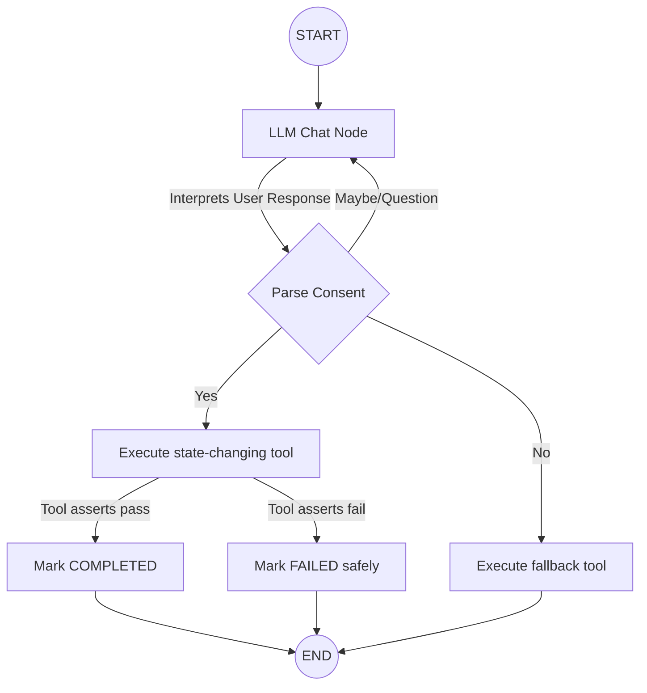

# LangGraph AI Recovery Agent Architecture

## 1. Purpose
The LangGraph Agent acts as the orchestrator and conversational interface for the Mandate Recovery Agent MVP. It consumes the output of the deterministic Decision Engine and interacts with the customer in natural language to negotiate and execute the prescribed action. 

Crucially, **the Agent is NOT the financial decision-maker.** It cannot invent retry dates, hallucinate probabilities, or override policy.

## 2. Why LangGraph?
LangGraph is used because payment recovery involves cyclical, stateful conversation. A customer might ask a clarifying question ("Wait, what happens if I say yes?"), which requires the LLM to respond and then loop back to asking for consent. A static linear prompt chain cannot handle this gracefully.

## 3. The Strict Boundary Tools
The most critical part of this architecture is `src/agent/tools.py`. Tools are Python functions annotated with `@tool`, but they are wrapped in strict, non-LLM assertions.

For example, `schedule_retry(agreed_date)` does the following BEFORE it executes:
1. Asserts `consent_granted == True`.
2. Asserts the `DecisionEngine` output authorized a `RESCHEDULE`.
3. Asserts the `agreed_date` exactly matches the ML-predicted `recommended_retry_date`.

If the LLM hallucinates a date, or tries to execute a retry after the customer said "No", the Python tool throws a `ToolException`, which LangGraph catches and maps to a safe `FAILED` action status.

## 4. State & Graph Design
The graph state is a `TypedDict` containing the immutable `decision_context` and the mutable `conversation_history` and `action_status`.

## 5. System Prompt Strategy
The system prompt (`prompts.py`) is dynamically injected with the output of the Decision Engine. It explicitly commands the LLM to adopt a specific conversational strategy depending on the directive. 

If the directive is `DO_NOT_RETRY`, the prompt strictly instructs the LLM: *"DO NOT ask for retry consent. Explain that automatic retry is not recommended."* 

## 6. Testing Strategy
To prove that the architectural constraints hold firm without racking up OpenAI API costs or relying on stochastic LLM behavior during CI/CD, the test suite (`test_agent_graph.py`) uses a `MockLLM`. 

The test manually injects adversarial LLM outputs (e.g., an LLM attempting to call `schedule_retry` with a date of `2099-01-01` despite the ML model authorizing `2026-07-01`). The tests assert that the tool boundary correctly blocks these rogue execution attempts, ensuring a safe fallback.
