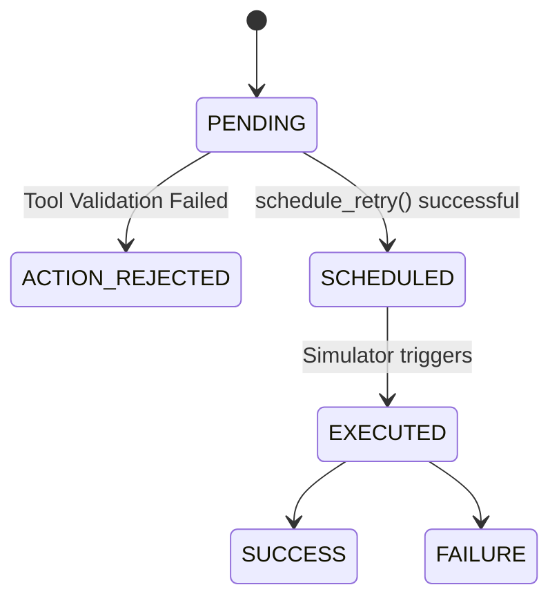

# Consent Service & Simulator

## 1. Two-Tiered Consent Model
The Mandate Recovery Agent enforces a strict two-tiered consent model:

1. **Financial Data Consent (Account Aggregator):** This is the pre-existing consent allowing the bank/merchant to read transaction history. It is tracked in `data/consents.csv` and validated by the `ConsentService`. The Agent *cannot* proceed if this is revoked or expired.
2. **Action Consent:** This is the explicit "Yes" given by the customer during the conversational negotiation with the Agent. It is tracked as `consent_granted` in the LangGraph state.

Both are required before a retry is scheduled.

## 2. State Machine Lifecycle
We persist the recovery lifecycle in a local SQLite database (`db/app_state.db`). The possible states are:

- `PENDING`: Initial state before decision.
- `SCHEDULED`: Action authorized, double-consent verified, and date locked.
- `EXECUTED`: Simulator has attempted the retry on the scheduled date.
- `ACTION_REJECTED`: Request failed boundary validation (e.g., hallucinated date, revoked consent).

## 3. Simulator & Ground Truth Isolation
To prevent data leakage during prototype evaluation, the `PaymentSimulator` is the **only** component allowed to touch `ground_truth_recoverable` and `ground_truth_retry_date`.

It reads these values from `data/mandate_attempts.csv` exclusively at the moment of execution. 
- If the `scheduled_date` is on or after the `ground_truth_retry_date` (and the mandate is recoverable), the execution returns `SUCCESS`.
- Otherwise, it returns `FAILURE`.

This simulates real-world timing where a customer's salary deposit must arrive before the mandate retry will clear.

## 4. Failure Handling & Boundaries
The `MandateScheduler` actively rejects `schedule_retry` calls from the Agent if:
- `action_consent_granted == False`
- `ConsentService` reports `status != ACTIVE`
- The `agreed_date` does not exactly match the ML `recommended_retry_date`.

When a rejection occurs, the `OutcomeService` persists the `ACTION_REJECTED` state, providing an audit trail of the blocked hallucination or policy violation.
