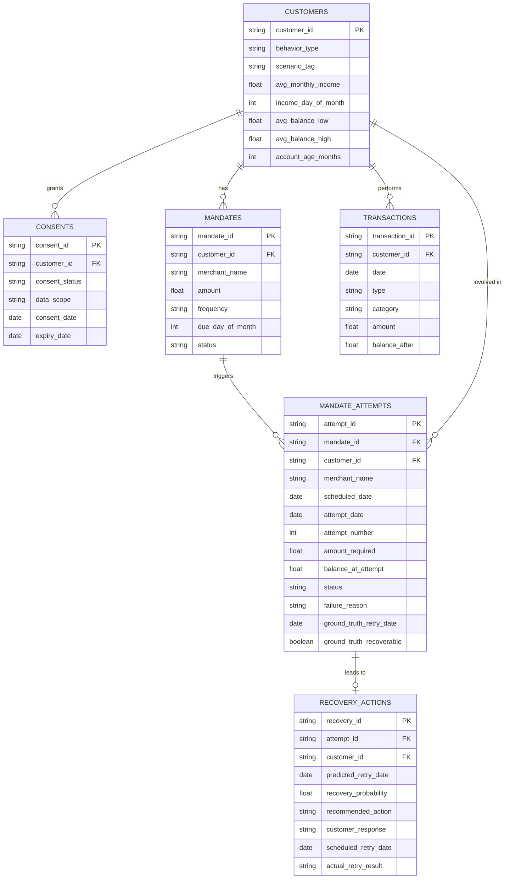

# Data Audit: Mandate Recovery Agent Datasets

## 1. Overview
The workspace contains 6 CSV datasets representing a synthetic financial ecosystem with mandates (UPI AutoPay), transactions, customer profiles, consents, and recovery actions. 

> **"The canonical CSVs were the given hackathon dataset; we treated them as ground truth and audited them for leakage — full audit in docs/DATA_AUDIT.md."**

This audit reviews the schemas, data quality, and relationship integrity across the datasets, and addresses critical data leakage concerns for Machine Learning tasks. For detailed dataset provenance and generator reconciliation, see [docs/DATA_PROVENANCE.md](DATA_PROVENANCE.md) and [docs/DATA_CONTRACT.md](DATA_CONTRACT.md).

---

## 2. Entity-Relationship (ER) Diagram

---

## 3. Dataset Schemas and Profiling

### 3.1 `customers.csv`
- **Row Count:** 168
- **Primary Key:** `customer_id` (Unique IDs present)
- **Missing Values:** `scenario_tag` (150 missing), `income_day_of_month` (36 missing). 
- **Categorical Fields:** 
  - `behavior_type`: EARLY_MONTH_SALARIED, FREELANCER_IRREGULAR, HIGH_SPENDER, MID_MONTH_SALARIED, RECOVERABLE_PATTERN, HIGH_MANDATE_RATIO, BUSINESS_OWNER
  - `scenario_tag`: GOLDEN_HIGH_MANDATE_RATIO, GOLDEN_SALARY_TIMING_MISMATCH, etc.

### 3.2 `transactions.csv`
- **Row Count:** 12,870
- **Primary Key:** `transaction_id`
- **Foreign Key:** `customer_id` (Integrity maintained)
- **Missing Values:** None
- **Categorical Fields:**
  - `type`: debit, credit
  - `category`: rent, salary, p2p, groceries, gig_payout, transfer_in, utility_bill, entertainment
- **Date Ranges:** Daily transactions simulating a ~90 day period based on the generator script.

### 3.3 `mandates.csv`
- **Row Count:** 284
- **Primary Key:** `mandate_id`
- **Foreign Key:** `customer_id`
- **Missing Values:** None
- **Categorical Fields:**
  - `merchant_name`: 11 unique values (e.g., Cult.fit Gym, Netflix, SIP - Mutual Fund)
  - `status`: active, paused, revoked
  - `frequency`: monthly

### 3.4 `mandate_attempts.csv`
- **Row Count:** 1,746
- **Primary Key:** `attempt_id`
- **Foreign Keys:** `mandate_id`, `customer_id`
- **Missing Values:** 
  - `failure_reason`: 1,383 missing (Expected for successful attempts)
  - `ground_truth_retry_date`: 1,602 missing
  - `ground_truth_recoverable`: 272 missing
- **Categorical Fields:**
  - `status`: SUCCESS, FAILED
  - `failure_reason`: INSUFFICIENT_BALANCE, TECHNICAL_FAILURE, ACCOUNT_ISSUE, BANK_DECLINED, MANDATE_REVOKED
  - `ground_truth_recoverable`: TRUE, FALSE

### 3.5 `consents.csv`
- **Row Count:** 168
- **Primary Key:** `consent_id`
- **Foreign Key:** `customer_id`
- **Missing Values:** None
- **Categorical Fields:**
  - `consent_status`: ACTIVE, REVOKED, EXPIRED
  - `data_scope`: TRANSACTIONS

### 3.6 `recovery_actions.csv`
- **Row Count:** 227
- **Primary Key:** `recovery_id`
- **Foreign Keys:** `attempt_id`, `customer_id`
- **Missing Values:** `predicted_retry_date` (81 missing), `scheduled_retry_date` (122 missing)
- **Categorical Fields:**
  - `recommended_action`: DO_NOT_RETRY, RETRY_NOW, RESCHEDULE, ALTERNATIVE_PAYMENT
  - `customer_response`: DECLINED, ACCEPTED, NO_RESPONSE, NOT_REQUIRED
  - `actual_retry_result`: SUCCESS, FAILED, NOT_ATTEMPTED

> [!TIP]
> **Duplicates:** Based on unique primary key counts, there are no exact duplicate rows in any of the provided datasets.
> **Foreign-Key Integrity:** All relationship foreign keys (`customer_id`, `mandate_id`, `attempt_id`) map correctly without orphan records, creating a sound relational structure.

---

## 4. Generator Status & Dataset Provenance

The provided `generate_synthetic_data.py` is an older/incomplete generator prototype and does **not** reproduce the current canonical six-file dataset. Major differences include:

1. **Missing Files:** The script only defines 4 datasets (`customers`, `transactions`, `mandates`, `mandate_attempts`). It has no logic to generate `consents.csv` or `recovery_actions.csv`.
2. **Schema Differences:**
   - In `customers.csv`: The generator script assigns an `income_type` (e.g., `salaried_fixed`), but the actual CSV contains enriched fields like `behavior_type` and `scenario_tag`.
   - In `mandate_attempts.csv`: The generator script does not output the `ground_truth_retry_date` or `ground_truth_recoverable` columns.
3. **Output Paths & Scale:** The script writes to Linux-style paths (`/mnt/user-data/outputs/...`) and simulates only 120 customers, whereas the canonical dataset contains 168 customers and 1,746 attempts.

**Conclusion:** The existing `generate_synthetic_data.py` is **not** part of the final data-generation or recovery pipeline and does not need to be rewritten for hackathon submission. The six canonical CSVs are the authoritative input dataset. For details, see [docs/DATA_PROVENANCE.md](DATA_PROVENANCE.md) and [docs/DATA_CONTRACT.md](DATA_CONTRACT.md).

---

## 5. ML Data Leakage Analysis (Provenance of Fields)

If you plan to use this data to train a Machine Learning model (e.g., to predict the likelihood of recovering a failed mandate and recommend actions), you must address the following critical **data leakage** and provenance issues:

> [!CAUTION]
> **Data Leakage** occurs when a model is trained with features that will not be available at prediction time in the real world, essentially allowing the model to "cheat" by looking at the answer.

### The Problematic Fields:
* **`ground_truth_retry_date`** & **`ground_truth_recoverable`** (in `mandate_attempts.csv`)
  * **Provenance:** These fields were likely injected post-generation by a script that looked ahead into the `transactions.csv` to see if the user *eventually* had a high enough balance.
  * **Leakage Risk (Extreme):** If these fields are fed into your model as features, the model will achieve 100% artificial accuracy because these fields represent the exact target variable you are trying to predict (whether the attempt is recoverable, and when). They should **only** be used as the target/labels ($y$), never as input features ($X$).

* **`recovery_probability`** & **`predicted_retry_date`** (in `recovery_actions.csv`)
  * **Provenance:** These are predictions. They were generated by a heuristic engine or a prior model run, rather than being ground-truth events.
  * **Leakage Risk:** If you train a new model using `recovery_actions.csv` and include these fields, your new model will simply learn to copy the old model/heuristics instead of learning the underlying transactional patterns.

* **`recommended_action`** (in `recovery_actions.csv`)
  * **Provenance:** Derived deterministically from `recovery_probability` or an AI policy.
  * **Leakage Risk:** Training on this to predict what action to take is circular. The model will learn the previous system's rules engine. If the goal is to *learn* the best action, you must train on `actual_retry_result` instead.

### Recommendation for ML Pipeline:
When building your dataset for the ML agent:
1. Join `mandate_attempts` with `transactions` (only using transactions *prior* to the `attempt_date`).
2. Use `ground_truth_recoverable` purely as your target label.
3. Completely drop `ground_truth_retry_date` from the input feature set.
4. Ignore `recovery_probability` and `recommended_action` from `recovery_actions.csv` during training, unless you are treating this purely as an imitation learning task (which is not recommended).
