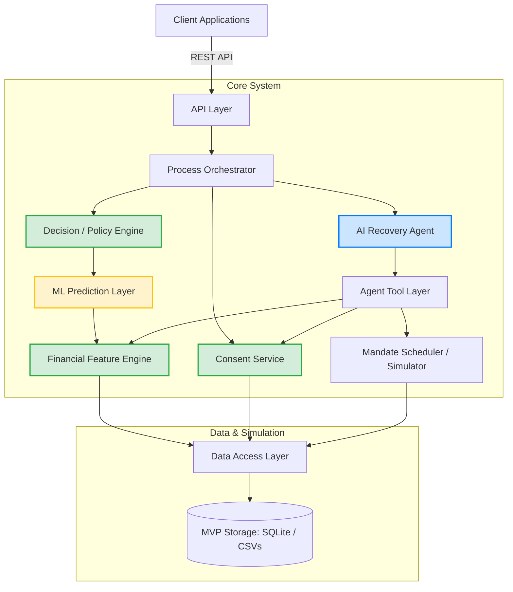

# System Architecture: Mandate Recovery Agent

## 1. Architecture Overview
This document outlines the technical architecture for the Mandate Recovery Agent MVP. The system is designed to be technically credible for a 5-day hackathon while strictly adhering to the boundaries established in the PRD and Data Contract. It avoids unnecessary distributed infrastructure, focusing instead on clear boundaries between deterministic logic, ML predictions, policy enforcement, and LLM-driven agentic interactions.

## 2. High-Level Architecture Diagram

## 3. Major Components

- **Frontend / Merchant Dashboard & Customer UI:** A simple web interface (e.g., Streamlit, React, or Gradio) to visualize failed mandates, recovery metrics, and host the customer-facing chat interface for the agent.
- **API Layer:** Lightweight REST API (e.g., FastAPI or Flask) exposing endpoints to trigger the recovery pipeline and interact with the agent.
- **Data Access Layer (DAL):** The single source of truth for reading/writing data. Responsible for enforcing time-travel protections (ensuring `date <= attempt_date` for feature queries).
- **Financial Feature Engine:** Deterministic code that aggregates transaction history to compute income cadence, average balances, and spending velocity.
- **Recovery Probability Model:** The ML classification model predicting the likelihood of recovery (simulating prediction of `ground_truth_recoverable`).
- **Retry Window Predictor:** The ML regression model predicting the optimal date with highest predicted recovery probability for a retry.
- **Decision / Policy Engine:** A deterministic rules engine that takes the ML probabilities and maps them to concrete actions based on configurable business thresholds.
- **Consent Service:** A deterministic gateway that reads `consents.csv` and strictly blocks any unauthorized access to customer transaction data.
- **AI Recovery Agent:** The LLM orchestrator responsible for negotiating the retry date with the user in natural language.
- **Agent Tool Layer:** The set of well-defined functions (tools) exposed to the LLM, tightly restricting what the LLM can see and do.
- **Mandate Scheduler / Simulator:** A mock execution engine that takes scheduled retries and evaluates their success against the canonical dataset's ground truth.
- **Evaluation Layer:** A background script/process used exclusively to compute success metrics (AUC, MAE, recovery rate) for the MVP demo.

## 4. Data Flow
**Tracing a single failed mandate:**
1. **Ingestion:** API receives a webhook/event for a failed `attempt_id`.
2. **Analysis:** Orchestrator calls the Consent Service. If `ACTIVE`, it calls the Financial Feature Engine to summarize the customer's past transactions.
3. **Prediction:** The ML Layer consumes the features and returns a `Recovery Probability Score` (e.g., 78%) and `Predicted Retry Date` (e.g., 5th of next month).
4. **Decision:** The Policy Engine evaluates the 78% score against the configured threshold (e.g., >60%). It routes the mandate to the AI Agent with a `RESCHEDULE` directive.
5. **Agent:** The AI Agent is initialized and messages the user.
6. **Consent:** The user chats with the agent and explicitly agrees to the new date. The agent uses the `request_customer_consent` tool.
7. **Action:** The agent uses the `schedule_retry` tool.
8. **Outcome:** The Simulator logs the retry and checks `ground_truth_recoverable` and `ground_truth_retry_date` to determine if the simulated retry succeeded or failed.

## 5. ML vs Deterministic vs LLM Boundaries

To ensure strict compliance and prevent hallucinations, boundaries are defined as follows:

- **Deterministic Code:** 
  - Transaction aggregations (Feature Engine).
  - Checking `consents.csv` (Consent Service).
  - Threshold comparisons (Policy Engine).
  - Interacting with the database (DAL).
- **ML/Statistical Prediction:** 
  - Generating the raw probability score.
  - Predicting the target retry date.
- **Policy/Decision Logic:** 
  - Deciding whether a user goes to the Agent, gets paused, or is sent a manual payment link.
- **LLM Agent:** 
  - Parsing the user's natural language responses.
  - Generating polite, empathetic text.
  - Choosing which provided Tool to execute based on the conversation state.
  - *The LLM MUST NEVER independently calculate financial probabilities or bypass consent/policy controls.*

## 6. Agent Architecture
The AI Recovery Agent is granted access *only* to the following tools via the Agent Tool Layer:

**Read-Only Tools:**
- `get_mandate_details(mandate_id)`
- `get_failure_reason(attempt_id)`
- `get_customer_financial_pattern(customer_id)` *(Blocked internally if consent is invalid)*
- `get_recovery_probability(attempt_id)`
- `get_retry_window(attempt_id)`
- `check_consent(customer_id)`

**State-Changing Tools:**
- `request_customer_consent(mandate_id, agreed_date)`: Logs the user's chat agreement.
- `schedule_retry(mandate_id, date)`: Enters the mandate into the simulator queue.
- `trigger_fallback(mandate_id, action_type)`: Stops the agent flow and routes to alternative recovery.

## 7. Consent Boundary
**Where is consent checked?**
1. **Before Data Access:** The Orchestrator calls the Consent Service before passing the `customer_id` to the Feature Engine. If consent is `EXPIRED` or `REVOKED`, the feature engine returns empty arrays, forcing the Policy Engine into a fallback route.
2. **Before Agent Interaction:** The Agent Tool Layer wraps all financial data tools with a consent check middleware.
3. **Before Scheduling:** The simulator verifies that explicit user agreement was captured during the chat before accepting a `schedule_retry` command.

## 8. Recovery Decision Flow
The Decision/Policy Engine outputs one of the following directives based on ML probabilities and a **configurable threshold** (e.g., `RECOVERY_THRESHOLD_PROBABILITY`, evaluated and tuned during development, not hard-coded to 50%):

- `RETRY_NOW`: Attempt immediately (usually for technical failures).
- `RESCHEDULE`: Trigger Agent to negotiate the ML-predicted optimal date.
- `WAIT_FOR_BETTER_WINDOW`: Passively wait; customer has highly irregular income.
- `DO_NOT_RETRY`: Customer shows zero capacity to pay (e.g., job loss).
- `ALTERNATIVE_PAYMENT`: Send a manual payment link (e.g., mandate is paused).
- `REAUTHORIZE_MANDATE`: Customer's mandate was revoked at the bank level.

## 9. Simulation Layer
Because the MVP cannot execute real transactions, the Simulator replaces real banking integrations:
- **Scheduling:** Stores the `agreed_date` in an in-memory or SQLite queue.
- **Execution & Outcome:** When the simulated clock hits the `agreed_date`, the simulator checks the original `mandate_attempts.csv`.
  - If `ground_truth_recoverable == TRUE` AND `agreed_date >= ground_truth_retry_date`, the simulator logs a **SUCCESS**.
  - Otherwise, it logs a **FAILURE**.

## 10. API Boundaries (Proposed)
- `POST /api/webhooks/mandate-failure`: Ingests a new failure attempt.
- `GET /api/merchant/mandates`: Returns dashboard analytics.
- `GET /api/agent/chat-history/{attempt_id}`: Retrieves chat state.
- `POST /api/agent/message`: Sends user input to the LLM agent and returns the response/tool execution.

## 11. Data Storage
**Hackathon Recommendation:** 
- Do not use distributed databases (PostgreSQL/Redis) unless necessary.
- Use **SQLite** via SQLAlchemy or SQLModel for easy, local, relational querying.
- On startup, ingest the 6 canonical CSVs into SQLite tables.
- Use SQLite to write new state (e.g., simulated retries, chat logs) without modifying the original canonical CSVs.

## 12. Failure and Edge Cases
- **Expired/Revoked Consent:** ML features are blocked. Policy Engine routes directly to `ALTERNATIVE_PAYMENT`.
- **Revoked Mandate:** Policy Engine routes directly to `REAUTHORIZE_MANDATE`.
- **Technical Failure:** Bypasses ML/Agent entirely; routes to `RETRY_NOW`.
- **Insufficient Balance & Low Probability:** Routes to `DO_NOT_RETRY` and recommends pausing the subscription.
- **Missing Financial History:** Treats as low confidence; utilizes conservative fallback.
- **Customer Declines Consent:** Agent uses `trigger_fallback(DECLINED)`.
- **Retry Failure:** Logged by the simulator; stops further automated retries to prevent looping.

## 13. Security / Responsible AI Boundaries
- **Consent Enforcement:** Hardcoded at the DAL/Tool layer.
- **No Silent Retries:** `schedule_retry` tool requires a valid conversational consent token.
- **No Future-Data Leakage:** DAL strictly filters transactions by `date <= attempt_date` before feeding them to the Feature Engine.
- **No LLM Financial Authority:** The LLM cannot change the probability score or generate arbitrary retry dates without querying the ML layer tools.
- **Auditability:** All Agent tool invocations and Decision Engine routing steps are logged to a tracing table in SQLite.

